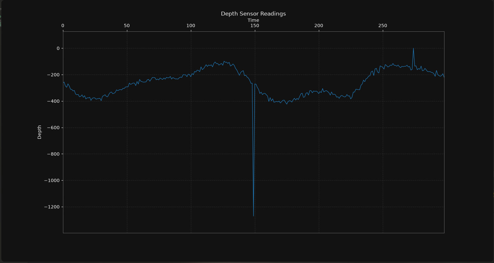
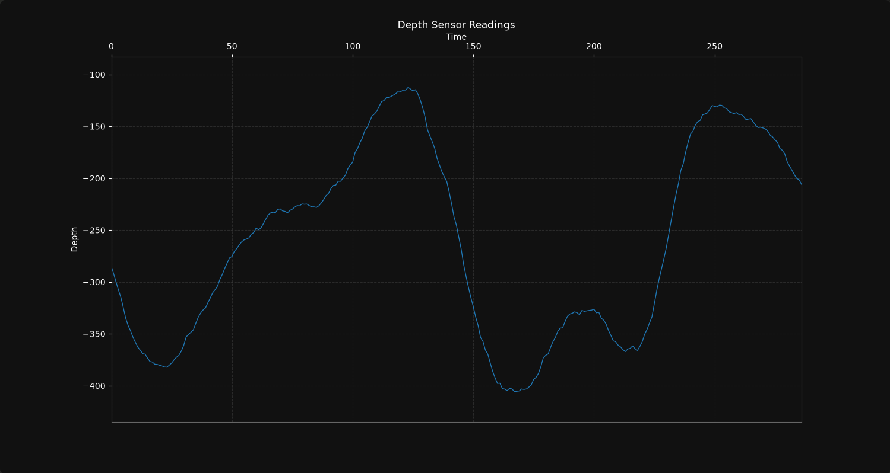

# Task 1: Finding the sea floor

Rushvith Anthagiri
2026A7PS2003H
f20262003@hyderabad.bits-pilani.ac.in

### Overview:
- To extract the data from the csv file I used the csv library to automatically extract the values from the file and store them in an array.
- To find and remove anomalies I calculated a local median around each value, and removed it if the value was a certain threshold above/below the median.
- To smoothen the curve and reduce noise I used the numpy convolve function which smoothens the values using a given window.
- To plot the graph I used matplotlib, a simple graph plotting library. The library has functions to update it every second to simulate a real sensor taking readings every second.

### Screenshot of graph without anomaly removal or smoothing:

### Screenshot of graph with anomalies removed and smoothing applied:
