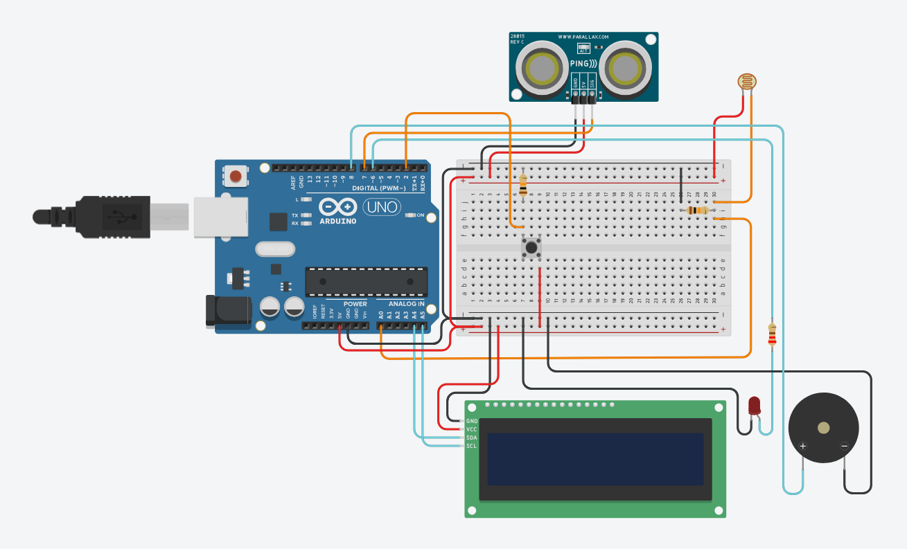

# Task 2: Keeping watch over Odysseus

- Rushvith Anthagiri
- 2026A7PS2003H
- f20262003@hyderabad.bits-pilani.ac.in

### Overview
- I am using an ultrasonic distance sensor to detect distance to the nearest object.
- I am using a photoresistor connected to a voltage divider to detect light levels.
- For output, I am using an I2C LCD display, an LED and a buzzer.
- I connected all the components to the arduino using a breadboard for cleaner wiring.
- The arduino functions as a state machine, using the given states and conditions.

### Screenshot of wiring

### Link to the tinkercad project
https://www.tinkercad.com/things/8PBY9jKOh1o/editel?returnTo=%2Fdashboard&sharecode=b8mEAh4bR_hIGSnVLgpDRwgaP0lyRVvIsGUkJlg40R8